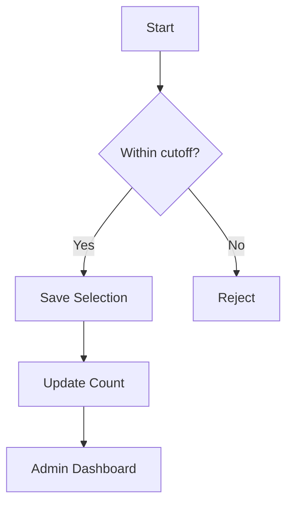
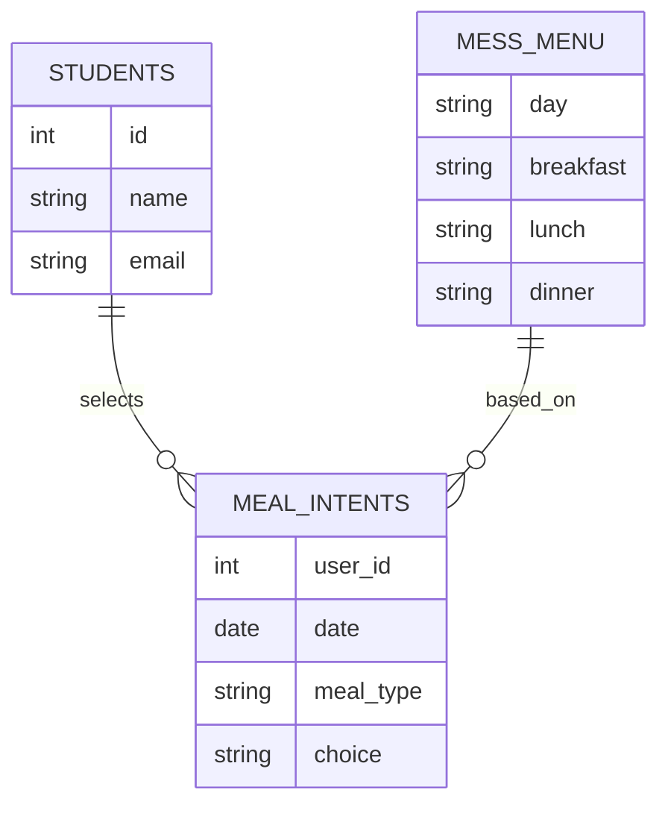
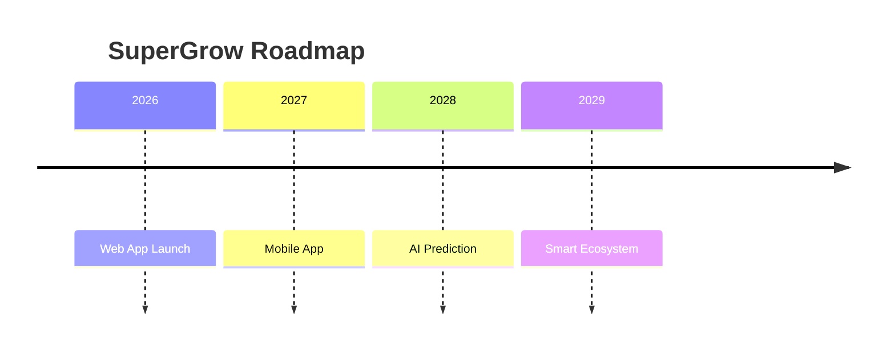

````md
# 🌱 SuperGrow – Smart Mess Management System  
### 🚀 From Guesswork → Data-Driven Meal Planning

---

## 💡 The Idea
Every day, mess kitchens either **overcook and waste food** or **undercook and fall short**.

**SuperGrow** solves this by allowing users to **select meals in advance**, helping kitchens prepare the exact quantity needed.

---

## 🎯 Problem vs Solution

| ❌ Traditional Mess | ✅ SuperGrow |
|-------------------|------------|
| No planning       | 📊 Real-time demand tracking |
| Food wastage      | ♻️ Optimized cooking |
| Manual tracking   | ⚡ Automated system |
| No flexibility    | 👤 User meal selection |

---

## 🧭 User Flow

```mermaid
flowchart LR
A[User Login] --> B[View Menu]
B --> C[Select Meals]
C --> D{Within cutoff?}
D -->|Yes| E[Save in Database]
D -->|No| F[Reject]
E --> G[Admin Dashboard]
G --> H[Kitchen Planning]
````

---

## 🧩 System Architecture

```mermaid
flowchart TD
User -->|Select Meal| Frontend
Frontend -->|Request| Backend
Backend -->|Store| Database[(MySQL)]
Database --> Backend
Backend --> AdminDashboard
AdminDashboard --> Kitchen
```

---

## ⚡ Key Features

* 🍽️ Meal Selection System
* ⏱️ Time-Based Booking Logic
* 📊 Real-Time Meal Tracking
* 📅 Weekly Menu Management
* 🔐 Secure Authentication
* ⚡ Lightweight Backend

---

## 🧠 Working Logic



---

## 🛠️ Tech Stack

```
Frontend   → HTML | CSS | JavaScript
Backend    → PHP (Core)
Database   → MySQL
Server     → Apache (XAMPP)
```

---

## 📊 Database Design



---

## 🔥 Highlights

* 💡 Real-world problem solving
* 🌍 Reduces food wastage
* 📊 Data-driven decisions
* ⚙️ Scalable system
* 🚀 Deployment ready

---

## 🚀 Future Scope



---

## 🧪 Setup Instructions

```bash
git clone https://github.com/Alok8910/supergrow.git
```

1. Move project to `htdocs`
2. Import database
3. Update `/app/config.php`
4. Start Apache & MySQL
5. Open `http://localhost/supergrow`

---

## 👨‍💻 Author

**Alok Kumar**

````

---

## 🚨 Why your error happened (simple)
- ❌ Diagram not inside ```mermaid  
- ❌ Emoji inside diagram text sometimes breaks parsing  
- ❌ Missing spacing between sections  

---

## 💡 Pro Tip (Hackathon Winning Move)
After fixing this:
- Add **2–3 screenshots**
- Add **demo video link**
- Add **live URL (if possible)**

That alone can push you ahead of others.

---

If you want next level:
:contentReference[oaicite:0]{index=0} or **:contentReference[oaicite:1]{index=1}**
````
